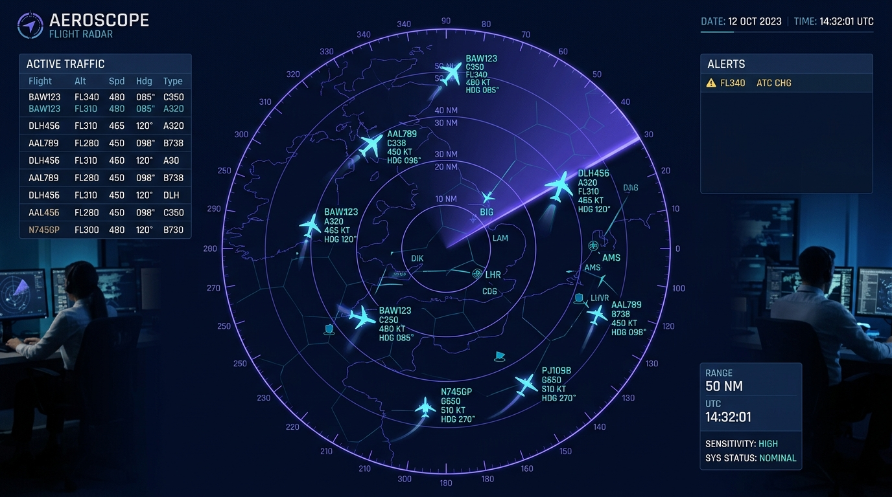
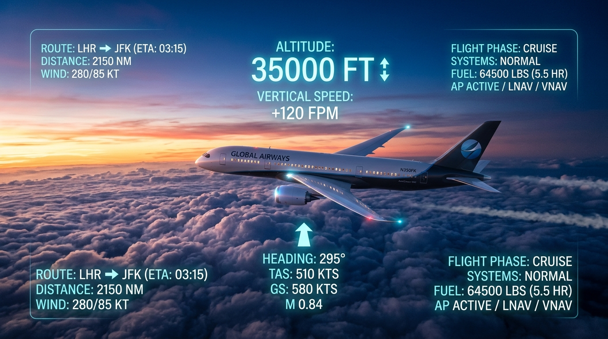

# ✈️ Skybound & Travel Tracker

> **Real-time overhead flight tracking radar paired with instant visa intelligence and Google Drive travel integration for Bangladeshi passport holders.**

<div align="center">
  
  <p><em>লাইভ এডিএস-বি রাডার স্কোপ: মাথার ওপর দিয়ে উড়ে যাওয়া বিমান ও টেলিমেট্রি ট্র্যাকিং</em></p>
</div>

Skybound & Travel Tracker is a modern web application that bridges real-time aviation telemetry with international travel regulations. By detecting aircraft flying directly over your current GPS coordinates, the application instantly maps their flight paths to destination countries and cross-references them against immigration rules, visa policies, and document requirements.

---

## 📖 Application Overview

When you look up at an aircraft crossing the sky, **Skybound & Travel Tracker** answers two immediate questions:
1. *What flight is that, how fast and high is it flying, and where is it heading?*
2. *Can I travel to that destination with my passport, and what are the visa rules?*

The application renders a high-performance 2D Canvas radar screen centered on your coordinates, dynamically tracks both commercial and private flights within an adjustable radius (100 km – 800 km), and provides travel planning tools including Google Drive itinerary sync.

---

## 🌟 Key Features

### 1. 📡 Real-Time Flight Tracking (Live ADS-B Radar)
- **Interactive 2D Radar Canvas**: Real-time rotating sweep beam with phosphorescent persistence, range rings, and interactive aircraft markers.
- **Aircraft Categorization**:
  - **Commercial Airliners**: Passenger flights with airline identification, flight numbers, altitudes, and speeds.
  - **Private Executive Jets**: Corporate charters, business aviation, and private jets highlighted with distinctive icons and tags.
- **Aviation Telemetry**: Displays calibrated altitude (ft), ground speed (knots), true heading/track, ICAO24 transponder addresses, and climb/descent rates.
- **Flexible Radar Range**: Easily adjust the search radius between 100 km and 800 km or refresh live airspace on demand.
- **Intelligent Fallback Engine**: Seamlessly falls back to simulated realistic regional air traffic if the OpenSky Network API encounters rate limits or network latency.

### 2. 🌍 Visa Exploration & Intelligence

<div align="center">
  
  <p><em>বাংলাদেশী পাসপোর্ট এন্ট্রি রিকোয়ারমেন্টস, ভিসা ক্যাটাগরি ও বিস্তারিত ট্রাভেল গাইড</em></p>
</div>

- **Instant Destination Mapping**: Tapping any overhead aircraft reveals destination details and immediate visa requirements for Bangladeshi passport holders.
- **Color-Coded Immigration Status**:
  - 🟢 **Visa-Free (সবুজ)**: Direct entry without prior visa procedures.
  - 🟡 **Visa on Arrival / VoA (হলুদ)**: Visa issued upon landing at the destination airport.
  - 🔵 **eVisa / ETA (নীল)**: Fast electronic visa or electronic travel authorization before departure.
  - 🔴 **Visa Required (লাল)**: Physical sticker visa or consular application required prior to departure.
- **Comprehensive Country Directory**: Full search and filter capabilities across global destinations, including allowed length of stay, fees, processing timelines, and required documents (bank statements, invitations, insurance).

### 3. 🗺️ Floating Map Legend (`MapLegend`)
- **Semi-Transparent Backdrop-Blurred Box**: Positioned in the bottom-left corner of the radar display using Tailwind CSS (`backdrop-blur-md`).
- **Quick Reference Keys**: Visual guide explaining commercial vs. private plane icons alongside the color-coded visa status indicators.
- **Collapsible Design**: One-tap toggle to expand or minimize for an unobstructed view of the radar scope.

### 4. 🔔 High-Altitude Flight Browser Notification System

<div align="center">
  
  <p><em>হাই-অল্টিটিউড ক্রুজিং টেলিমেট্রি এবং ব্রাউজার নোটিফিকেশন অ্যালার্ট সিস্টেম</em></p>
</div>

- **HTML5 Notification API Integration**: Delivers native operating system notifications when a high-altitude aircraft enters the user's predefined radar radius.
- **Cruising Altitude Filtering**: Configurable altitude threshold (28,000 ft, 30,000 ft, or 35,000 ft) targeting high-altitude commercial jetliners and long-haul transit flights.
- **Interactive Action**: Clicking the browser push notification immediately focuses the app and selects the aircraft on the radar with destination visa intelligence.
- **Dual Alert Modality**:
  - Native OS push notification via `Notification.requestPermission()`.
  - Floating in-app alert banner with direct "Track on Radar" actions (especially convenient in iframe previews).
- **Aviation Radar Chime**: Soft dual-tone radar audio ping synthesized via Web Audio API.
- **Permission & Test Controls**: Built-in modal with one-click permission authorization and instant test notification trigger.

### 5. 📁 Google Drive Integration
- **Direct Cloud Export**: Save any flight itinerary, destination guide, or visa checklist directly to your personal Google Drive with a single click.
- **In-App Drive File Manager**: View, organize, and access previously saved travel notes and flight details without leaving the platform.
- **Secure Client-Side Authorization**: Leverages Google Identity Services OAuth 2.0 with minimal required drive scopes (`drive.file`).

### 6. 📱 Progressive Web App (PWA) & Mobile Installation
- **অফিসিয়াল হোমস্ক্রিন লোগো**: Android ও iOS উভয় প্ল্যাটফর্মে অ্যাপটি ইন্সটল করলে ফোনের হোম স্ক্রিনে **Skybound** এর কাস্টম লোগো ও আইকন তৈরি হয় (`192x192`, `512x512`, `maskable`, `apple-touch-icon`)।
- **ওয়েবসাইট ব্র্যান্ডিং**: ব্রাউজার ট্যাবে ফেভিকন, বুকমার্ক এবং হেডার নেভিগেশনে আকর্ষণীয় গ্লোয়িং এভিয়েশন ব্যাজ।
- **স্ট্যান্ডঅ্যালোন মোড**: ব্রাউজার অ্যাড্রেস বার ছাড়া ফুল-স্ক্রিন দেশীয় মোবাইল অ্যাপ এক্সপেরিয়েন্স।
- **ইন-অ্যাপ ইনস্টল ডায়ালগ**: অ্যান্ড্রয়েড এবং আইফোনের জন্য স্পষ্ট নির্দেশনাসহ `PWAInstallModal` এবং `usePWAInstall` হুক।

### 7. 🌐 Social Media Sharing with Rich Picture Cards
- **OpenGraph & Twitter Card ইন্টিগ্রেশন**: WhatsApp, Facebook, X (Twitter), Telegram, LinkedIn বা মেসেঞ্জারে লিংক শেয়ার করলেই ১২০০×৬৩০ পিক্সেলের হাই-ডেফিনিশন প্রিভিউ ব্যানার ইমেজ ও ডেসক্রিপশন স্বয়ংক্রিয়ভাবে ভেসে ওঠে।
- **ইন-অ্যাপ শেয়ারিং মডাল (`ShareModal`)**:
  - **পিকচার প্রিভিউ ব্যানার সিলেক্টর**: ব্যবহারকারী চাইলে "রাডার ভিউ ব্যানার" বা "ভিসা গাইড ব্যানার" বেছে নিতে পারেন।
  - **ছবি ডাউনলোড সুবিধা**: সরাসরি ডিভাইস গ্যালারিতে ব্যানার ইমেজ ডাউনলোড করে সোশ্যাল মিডিয়া পোস্ট বা স্টোরিতে শেয়ার করার অপশন।
  - **১-ক্লিক মাল্টি-প্ল্যাটফর্ম শেয়ারিং**: WhatsApp, Facebook, Telegram, X (Twitter), LinkedIn এবং Email।
  - **মোবাইল নেটিভ শেয়ারিং**: মোবাইলে ইনস্টল করা যেকোনো মেসেঞ্জার অ্যাপে (Imo, Messenger, Instagram, Discord) পাঠানোর জন্য `navigator.share` ইন্টিগ্রেশন।
  - **নির্দিষ্ট বিমান শেয়ারিং**: আকাশপথে কোনো নির্দিষ্ট বিমান সিলেক্ট করা থাকলে সেই বিমানের কলসাইন ও গন্তব্যের ভিসা তথ্যের ডায়নামিক প্রিভিউ কার্ড তৈরি হয়।

---

## 🛠️ Technical Stack

| Component | Technology | Description |
| :--- | :--- | :--- |
| **Frontend Framework** | [React 19](https://react.dev/) | Declarative UI state management and modular architecture |
| **Language** | [TypeScript](https://www.typescriptlang.org/) | Strict type safety for flight states, radar vectors, and visa models |
| **Styling & Design** | [Tailwind CSS](https://tailwindcss.com/) | Modern dark glassmorphism, responsive layouts, and utility styling |
| **Flight Telemetry API** | [OpenSky Network API](https://opensky-network.org/) | Live ADS-B state vectors for global airborne aircraft |
| **Cloud & Storage** | [Firebase](https://firebase.google.com/) & [Google Cloud](https://cloud.google.com/) | Cloud configuration and backend integration readiness |
| **Authentication & Drive** | [Google Identity Services (GSI)](https://developers.google.com/identity) | OAuth 2.0 token acquisition for Google Drive file creation |
| **Icons** | [Lucide React](https://lucide.dev/) | Consistent, crisp iconography across radar and visa views |
| **Animation** | [Motion](https://motion.dev/) | Smooth slide-up flight detail drawers and tab transitions |
| **Build Tool** | [Vite](https://vite.dev/) | High-speed module bundling and local development server |

---

## 📂 Project Architecture

```text
├── index.html                  # HTML5 entry point and meta tags
├── metadata.json               # Application settings, permissions & capabilities
├── package.json                # Project dependencies and npm scripts
├── README.md                   # Project documentation
├── src/
│   ├── App.tsx                 # Root application component, tabs & state
│   ├── main.tsx                # React DOM entry point
│   ├── index.css               # Global Tailwind CSS styling
│   ├── types.ts                # TypeScript interfaces (FlightState, VisaInfo, etc.)
│   ├── flightService.ts        # OpenSky API integration & radar simulation engine
│   ├── visaData.ts             # Curated visa requirements database
│   ├── driveService.ts         # Google Drive REST API integration
│   ├── auth.ts                 # Google Identity Services (GSI) OAuth handler
│   └── components/
│       ├── FlightRadar.tsx     # 2D HTML5 Canvas radar screen with sweep beam
│       ├── MapLegend.tsx       # Floating semi-transparent bottom-left legend
│       ├── FlightDetailCard.tsx# Slide-up modal with flight specs & visa rules
│       ├── VisaExplorer.tsx    # Global country visa search & filter explorer
│       └── DriveSavedPanel.tsx # Saved itineraries manager for Google Drive
```

---

## 🚀 Installation Instructions

### Prerequisites
- **Node.js**: v18.0.0 or higher
- **npm**: v9.0.0 or higher (or `pnpm` / `yarn`)

### Step 1: Clone or Open the Repository
```bash
git clone https://github.com/your-username/skybound-travel-tracker.git
cd skybound-travel-tracker
```

### Step 2: Install Dependencies
Install all required project packages defined in `package.json`:
```bash
npm install
```

---

## 💻 Guide on How to Run

### Development Mode
Start the local Vite development server:
```bash
npm run dev
```
Open your browser and navigate to:
```
http://localhost:3000
```
> **Note**: The dev server is configured to bind to `0.0.0.0:3000`. Allow location permissions in your browser when prompted to center the radar over your real GPS location.

### Building for Production
Create an optimized production build in the `dist/` directory:
```bash
npm run build
```

### Code Quality & Type Checking
Run the TypeScript compiler in check mode to ensure zero type errors:
```bash
npm run lint
```

---

## 🔒 Security & Permissions

1. **Geolocation (`navigator.geolocation`)**:
   - Used strictly on the client side to position the radar scope relative to the user.
   - Coordinates are never logged, stored on external databases, or shared.

2. **Google Drive Scopes**:
   - Uses the least-privilege `https://www.googleapis.com/auth/drive.file` scope.
   - Only accesses and modifies files created directly by this application.

---

## 📄 License
This project is open-source and available under the [MIT License](LICENSE).

Safe travels and clear skies! 🛫🌍
